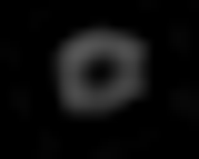
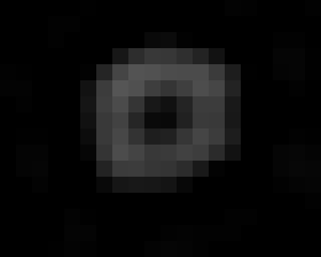

<p>
<h1 align="center">img2vid</h1>
<h5 align="center">A light weight matlab library for making exsiting images to videos </h5>
</p>

<p>

</p>

</br>
It contains all codes to generate the videos in the publication: **Weisong Zhao et al. Extending resolution of structured illumination microscopy with sparse deconvolution (2020) .........**
> v0.1
</br></br>


### Pipeline
- Load your exsiting images (captured with your camera or PMT) into memory:
`imreadRGBTiff` `imreadTiff`
- Process the images as your design:
`curtain` `radar` `colorm` `scalebar` `edging` `frame` `imlarge``appendt` `appendxy` `Merge` `tifresize` 

> Attention! The most important thing to create a video with `img2vid` is the concept of canvas. Specifically, before process the images, you should plan the canvas size of your video e.g. `zeros(2000,4000,3)`. Once the canvas is settled, all left is to draw (fill in) your canvas with your designed content.

- Save your results: `imwriteRGBstack` `imwritestack` 
- Print the label to the processed images.
- Make the videos! `draw_gif` `draw_avi`

### News
- Radar special effect
- imagejROI2Matlab from [@DylanMuir](https://github.com/DylanMuir/ReadImageJROI)
- imagej Animated Panning/Zoom in from [@cleterrier](https://github.com/cleterrier/Utils) with some modifications
- imagej ROI zoom in from [@ekatrukha](https://gist.github.com/ekatrukha/61a1138063591b524e043891e5201f3d)
- Basic features

### Instruction

- curtain.m: to creat the curtain-like special effect (comparison between multi-image). 

```python
/example1
rate=5;
data1=before;
data2{1}=after1;
data2{2}=after3;
img=curtain(data1,data2,rate)

/example2
data1=before;
data2=after;
img=curtain(data1,data2,rate)

/example3
for i=1:3
	data1=before(:,:,i);
	data2=after(:,:,i);
	img(:,:,i,:)=curtain(data1,data2,rate)
end
```
- radar.m: to creat the radar-like special effect (comparison between 2 images). 

```python
/example1
rate=5;
isRGB=1;
linewidth=1;
out = radar(data1,data2,rate,isRGB,linewidth);

/example2
rate=5;
isRGB=0;
linewidth=1;
outRGB = radar(data1,data2,rate,isRGB,linewidth);
out=squeeze(outRGB(:,:,1,:));
```
- colorm.m: to creat the color-coded special effect (t or z axial projection). The common colormap **jet** and **16_colors** is provided in this repo.

```python
large=zeros(975+130,1042*2+200,3);
jet=double(imread('16_colors.tif'));
Mito=3*SHMito;
Mito=edging(Mito,3);
Mito=scalebar(Mito,950,953,750,855);
Tubulin=scalebar(Tubulin,950,953,750,855);
Mito2=2*SIMMito;
Mito2=edging(Mito2,3);
Mito=colorm(Mito,jet);
Mito2=colorm(Mito2,jet);
flage=0;
for i=141:-1:1
    large=zeros(975+130,1042*2+200,3);
    flage=flage+1;
    mid=sum(Mito(:,:,:,i:140),4);
    mid=mid./max(mid(:));
    mid=edging(mid,3);
    mid=scalebar(mid,900,903,850,955);
    large(81:80+975,71:70+1042,:)=mid;
    mid=sum(Mito2(:,:,:,i:140),4);
    mid=10*mid./max(mid(:));
    mid=edging(mid,3);
    mid=scalebar(mid,900,903,850,955);
    large(81:80+975,141+1042:140+1042*2,:)=mid;
    large(651:650+size(ceil(i*256/120):256,2),131:162,1)=jet(:,256:-1:ceil(i*256/120),1)'/255;
    large(651:650+size(ceil(i*256/120):256,2),131:162,2)=jet(:,256:-1:ceil(i*256/120),2)'/255;
    large(651:650+size(ceil(i*256/120):256,2),131:162,3)=jet(:,256:-1:ceil(i*256/120),3)'/255;
    imwrite(large,['stage1\',int2str(flage),'.tif']);
end
```
- imlarge.m: Interestingly, if you have a small image (for example 50x50) and want to display it in large, the interpolation (if over 2 times) will make such image looks very blurry or oversmooth. This function will enlarge each pixel without interpolation to solve this problem.

```python
large=imlarge(imgsmall,20);
```
#### Example：left: interpolation, right: imlarge.
<p align='center'>
  
  
</p>

- draw_avi.m: You can DIY your specific video rate with a maximal rate.

```python
function draw_avi(display,filename,mag,Quality)
if nargin < 3 || isempty(mag)
    mag=1;
end
if nargin < 4 || isempty(Quality)
    Quality=100;
end
vid = VideoWriter(filename,'MPEG-4');
% vid = VideoWriter(filename,'Uncompressed AVI');
vid.Quality = Quality;
vid.FrameRate=30;
open(vid)
for i = 1 : 141
    for loop2=1:2
        imshow(display(:,:,:,i),'border','tight','initialmagnification','fit')
        set (gcf,'Position',[0,0,mag*size(display(:,:,i),2),mag*size(display(:,:,i),1)])
        axis normal
        drawnow;
        c = getframe;
        writeVideo(vid, c);
    end
end
for i = 141 : 141
    for loop2=1:60
        imshow(display(:,:,:,i),'border','tight','initialmagnification','fit')
        set (gcf,'Position',[0,0,mag*size(display(:,:,i),2),mag*size(display(:,:,i),1)])
        axis normal
        drawnow;
        c = getframe;
        writeVideo(vid, c);
    end
end
close(vid)
```
#### A code snippet to print label in matlab
```python
for i=142:349
    figure(1)
    flage=flage+1;
    large=imread(['stage1\',int2str(i),'.tif']);
    imshow(large,'border','tight','initialmagnification','fit')
    set (gcf,'Position',[0,0,1*size(large,2),1*size(large,1)])
    text1=text(920,40,['\it{Z axial position 0 ~ }',num2str(roundn((140)*(0.05),-2)),' (\mu\it{m})']);
    set(text1,'Color',[1,1, 0],'Fontsize',20,'Fontname','Arial')
    text1=text(500,45,['label1']);
    set(text1,'Color',[1,1,0.99],'Fontsize',20,'Fontname','Arial')
    text1=text(1580,45,['label 2']);
    set(text1,'Color',[1,1,0.99],'Fontsize',20,'Fontname','Arial')
    text1=text(1284,1005-(i-142)*4,['\it{y}']);
    set(text1,'Color',[1,1,0.99],'Fontsize',18,'Fontname','Arial')
    text1=text(1224,951-(i-142)*4,['\it{z}']);
    set(text1,'Color',[1,1,0.99],'Fontsize',18,'Fontname','Arial')  
    annotation(gcf,'arrow',[0.53 0.53],...
    [0.097+(0.0034)*(i-142) 0.17+(0.0034)*(i-142)],'Color',[1 1 1],'LineWidth',2);
    annotation(gcf,'arrow',[0.53 0.58],...
    [0.096+(0.0034)*(i-142), 0.096+(0.0034)*(i-142)],'Color',[1 1 1],'LineWidth',2);
    export_fig(gcf,['stage2\',int2str(flage),'total.png'])
end
for i=517:543
    figure(1)
    flage=flage+1;
    large=imread(['stage1\',int2str(i),'.tif']);
    imshow(large,'border','tight','initialmagnification','fit')
    set (gcf,'Position',[0,0,1*size(large,2),1*size(large,1)])    
    text1=text(230,505,['label1']);
    set(text1,'Color',[1,0,0],'Fontsize',25,'Fontname','Arial')     
    text1=text(280,545,['+']);
    set(text1,'Color',[1,1,1],'Fontsize',25,'Fontname','Arial')  
    text1=text(170,585,['label2']);
    set(text1,'Color',[0,1,0],'Fontsize',25,'Fontname','Arial')
    export_fig(gcf,['stage2\',int2str(flage),'total.png'])
end
```
## A video example

<p align='center'>
  
</p>

- `frame` aims to draw a rectangle ROI in the large field of view.
-  `appendt`and `appendxy` aim to append frames along different axes.
-   `Merge`and `tifresize` aim to append frames with different xy size along t axial.
-   `saclebar` aim to draw a scale bar.
-    `edging` aim to draw white boxes on the edge of images.

#### Why scripts, but not Adobe Premiere?
- To produce a large number of videos (for publications), the speed of scripts will much much faster than the `Adobe Premiere` type UI software. You may spend a little time on your first video, but with the accumulated code snippets, this will speed up much on your second video.
- To produce the data e.g. enlarge/[merge channels](https://github.com/WeisongZhao/Palette.ui)/curtain/scale bar/auto-label, scripts are faster, and more flexible than `Adobe Premiere`.
- In fact, in my opinion, the best way is to combine these tools, e.g. produce data with matlab scripts, and make videos with `Adobe Premiere`. But you may want to avoid twice video label production, which will leave to different label resolution.

#### Why Matlab scripts, but not other scripts?
- Certainly, python is also a good choice to produce the videos, and it is in the plan to add a pyhon version of `img2vid`.
- However, if you want to label a rectangle or an arrow on your videos, you will need the `matlab fig ui` to locate the specific position and angle of them. Additionally, in my usage, the images/videos/gif labeled and produced with python are usually with low resolution.
- Matlab is an integrated environment. For python, you have to find some effective packages myself to produce the label, and high resolution images/videos/gifs.
- HIT, and PKU have bought the matlab (:relaxed:).

## Addional dependency:
#### [export_fig](https://github.com/altmany/export_fig), [Zoom in ROI](https://gist.github.com/ekatrukha/61a1138063591b524e043891e5201f3d), and [Palette](https://github.com/WeisongZhao/Palette.ui)
You can find documents through the links! 
Also img2vid is accompanied with some imagej macro from [@HenriquesLab](https://twitter.com/HenriquesLab/status/1116955365344784385).

BTW, if you want to merge a multi-channel 2D or 3D (to MIP view) images, you can have a try on [Palette](https://github.com/WeisongZhao/Palette.ui). Palette enables users to ‘fine tune’ each merged color (exact weight of RGB components assembling, gamma, and gain setting for each channel).

## Open source [img2vid](https://github.com/WeisongZhao/img2vid)
This program is free software: you can redistribute it and/or modify it under the terms of the GNU General Public License as published by the Free Software Foundation, either version 3 of the License, or (at your option) any later version. This program is distributed in the hope that it will be useful, but WITHOUT ANY WARRANTY; without even the implied warranty of MERCHANTABILITY or FITNESS FOR A PARTICULAR PURPOSE. See the GNU General Public License for more details.
